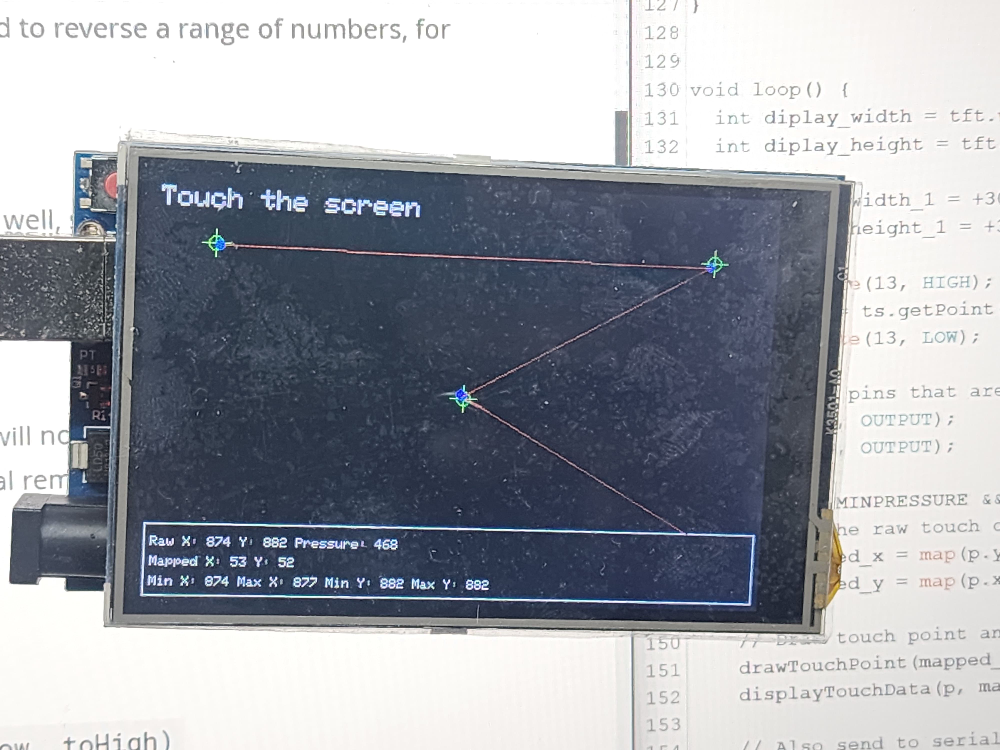

# 🎯 Touch Screen Calibration Tool v2.0



**An essential utility for accurate touch calibration on ILI9488 TFT LCD displays.**

---

## 📜 What is this project?

The **Touch Screen Calibration Tool v2.0** is a specialized tool for Arduino enthusiasts who work with resistive touchscreens, particularly on the 3.5-inch TFT LCD Shield with the ILI9488 controller. This tool helps map the raw touch sensor values to accurate screen coordinates, ensuring precise touch input.

By displaying crosshairs on different areas of the screen, you can use this tool to collect the raw values and adjust the calibration through serial commands in real-time. This is particularly useful when building touch-based projects like GUIs, dashboards, and interactive interfaces where accurate touch response is crucial.

---

## 🎯 Who is it made for?

- **Arduino Hobbyists:** Those experimenting with displays and touch interfaces.
- **Developers:** Working on projects involving touch screens with ILI9488 or similar controllers.
- **Tinkerers:** Building interactive IoT displays, control panels, or kiosk systems.
- **Educators/Students:** Teaching or learning how touch screen calibration works in hardware projects.

If you're dealing with inaccurate touch responses on your display, this tool is perfect for you!

---

## 🔍 Why is it made?

Resistive touch screens can often suffer from inaccuracies if they are not calibrated correctly. This tool helps solve that problem by offering:
- **Easy-to-use** on-screen crosshairs for calibration.
- **Real-time adjustments** via Serial monitor for quick and effective fine-tuning.
- A way to visualize and **validate** touch responses and their corresponding mapped coordinates.

This ensures your touch screen is accurately mapped and ready to use in any application requiring precise input.

---

## 🛠️ How to Use

### 🔌 1. Setup the Hardware
1. Attach the **3.5" TFT LCD Shield** to your Arduino (such as Uno, Mega, or similar).
2. Ensure you're using a display with the **ILI9488 controller** or equivalent that works with the **MCUFRIEND_kbv** library.
3. Wire the touchscreen pins as follows:
   - **XP = 8**
   - **XM = A2**
   - **YP = A3**
   - **YM = 9**

### ⚙️ 2. Install the Libraries
Make sure you have the following libraries installed:
- **MCUFRIEND_kbv** for controlling the TFT LCD.
- **TouchScreen.h** for handling the resistive touch input.

```
#include <MCUFRIEND_kbv.h>
#include <TouchScreen.h>
```

### 🖥️ 3. Upload the Code
- Upload the provided code to your Arduino using the Arduino IDE.
- After uploading, open the **Serial Monitor** to interact with the calibration tool.

### 🖱️ 4. Using the Calibration Tool
1. **Greeting Screen**: Once the device starts, a greeting screen will be shown for 10 seconds.
2. **Touch Crosshairs**: Follow the instructions and touch each crosshair on the screen as accurately as possible. 
3. **Adjust Calibration**: If the touch points aren't aligning properly, use the serial commands (explained below) to fine-tune the calibration.
4. **See Results**: Touch the screen and check the serial monitor for both raw and mapped values.

### ✏️ 5. Commands

You can adjust calibration values on-the-fly via the **Serial Monitor**:

- `left=XXX` - Set the TS_LEFT value (X-axis minimum).
- `right=XXX` - Set the TS_RT value (X-axis maximum).
- `top=XXX` - Set the TS_TOP value (Y-axis minimum).
- `bot=XXX` - Set the TS_BOT value (Y-axis maximum).
- `touch=XXX` - Set the touch pressure threshold.
- `clear` - Clears the screen and redraws the crosshairs.
- `print` - Prints the current calibration values.
- `help` - Shows the list of commands again.

Example commands:
```
left=220 right=920 top=140 bot=940 touch=300
```


Use these commands to ensure your touchpoints align with the crosshairs on-screen, then save the final values.

---

## 📊 Understanding the Output

When you touch the screen:
- A **red dot** will appear where the screen detects the touch.
- The raw X, Y coordinates and pressure will be printed to the serial monitor:
    ```
    Raw (x, y): 500, 750
    Map (x, y): 120, 320
    Pressure:  450
    ```
- Use these values to tweak your calibration settings if needed.

---


## 🎨 Customization

You can easily modify the code to:
- Change the **color** of the crosshairs and touch indicators.
- Adjust the **timeout** or delay before starting calibration.
- Customize **messages** on the TFT screen to suit your project’s needs.

---

## 💡 Applications

- **Interactive Kiosks**
- **IoT Dashboards**
- **Custom Control Panels**
- **Learning Tools for Touchscreen Programming**

---

## 🛠️ Requirements

- **Arduino Board** (Uno, Mega, or compatible)
- **3.5" TFT LCD Shield** with ILI9488 or equivalent controller
- **Libraries**: `MCUFRIEND_kbv`, `TouchScreen.h`

---

## 📚 Resources

- [MCUFRIEND_kbv Library Documentation](https://github.com/prenticedavid/MCUFRIEND_kbv)
- [TouchScreen Library](https://github.com/adafruit/Adafruit_TouchScreen)

---

## 🤝 Contributing

Feel free to submit issues, pull requests, or suggestions to improve this project!

Made with ❤️ by [Rahul](https://github.com/rahulsingh97).

---

## 📜 License

This project is licensed under the MIT License. See the [LICENSE](LICENSE) file for more details.

---

Enjoy using the **Touch Screen Calibration Tool** and feel free to reach out for any questions or support! 😊

---
